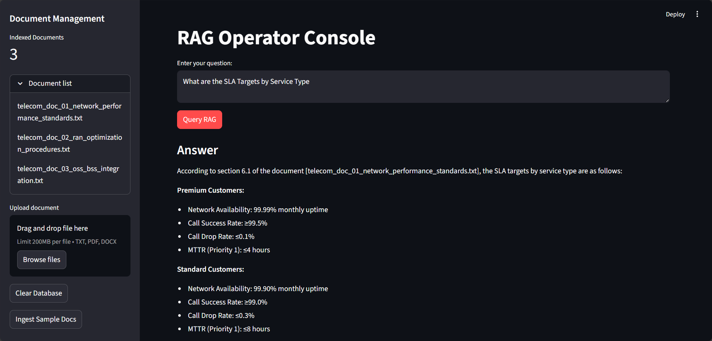
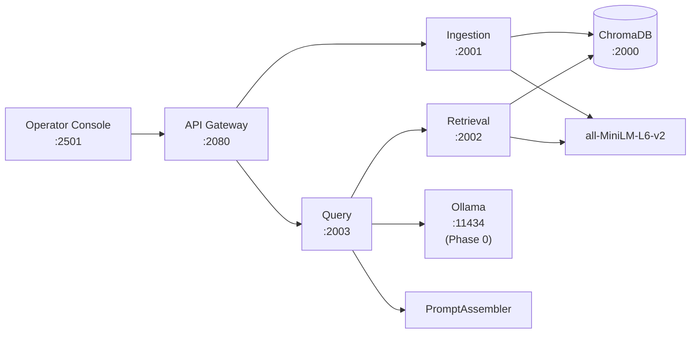
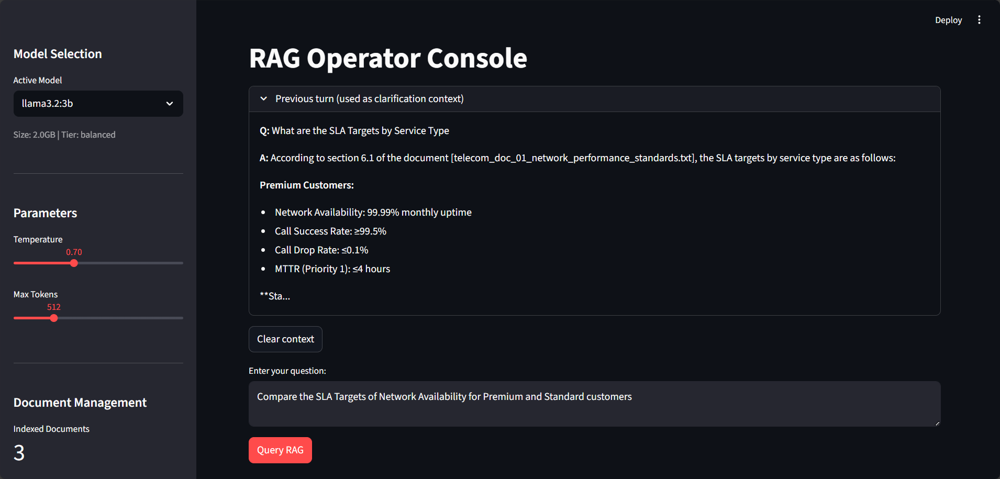
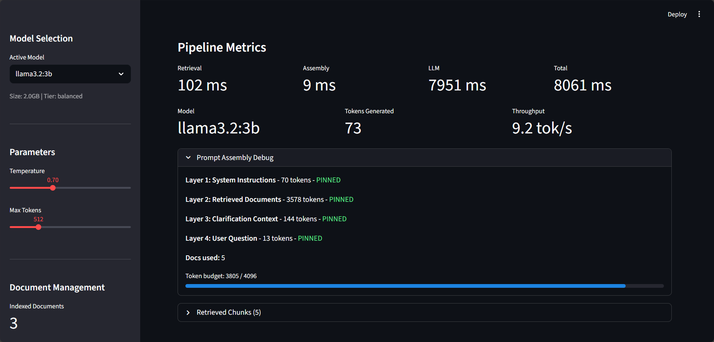
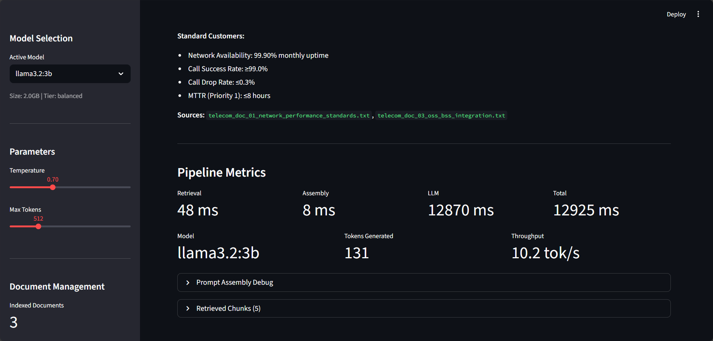
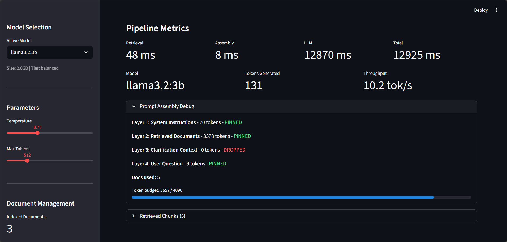
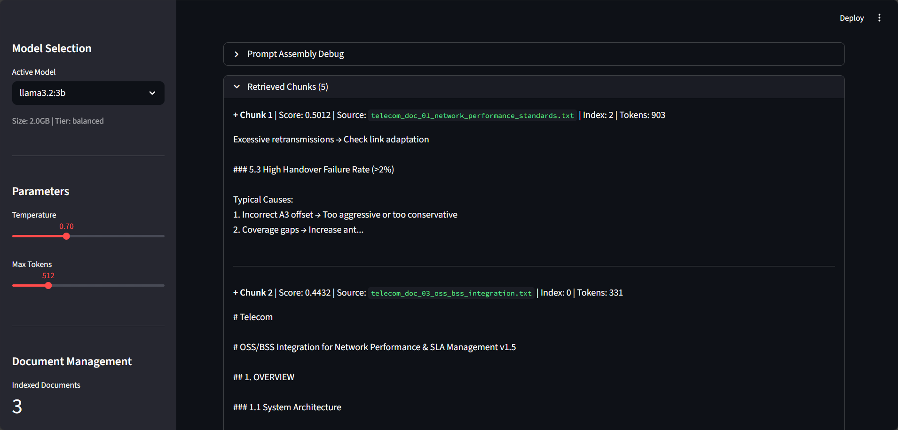

# RAG Operator Console

Full RAG implementation with explicit prompt assembly and operator visibility for debugging and validation.

**Part of the [GenAI Portfolio Suite](https://github.com/adityonugrohoid) - Phase 2: RAG Pipeline + Operator Debugging UI.**

## Highlights

- **Prompt Assembly** - explicit 4-layer prompt ordering with token-aware budgeting (4096 token context)
- **Full Observability** - pipeline metrics, prompt assembly debug, retrieved chunks panel
- **1-Turn Clarification** - previous Q&A automatically carried as context for follow-up questions
- **Multi-Model** - 6 local Ollama models across 3 tiers (fast/balanced/quality)
- **Operator Console** - Streamlit UI focused on RAG query debugging



## Architecture



Ollama runs as a shared service from [Phase 0: ollama-runtime](https://github.com/adityonugrohoid/ollama-runtime). All phases connect via the `ollama-runtime-network` Docker network.

## Prompt Assembly

Each query is assembled with strict 4-layer ordering:

| Layer | Content | Priority |
|-------|---------|----------|
| 1 | System Instructions | Pinned (never truncated) |
| 2 | Retrieved Documents | Highest priority grounding |
| 3 | Clarification Context | Previous turn only, dropped first under token pressure |
| 4 | Current User Question | Pinned (always included) |

Token budget: 4096 tokens. When budget is tight, Layer 3 (clarification) is dropped first to preserve document grounding. The operator console visualizes each layer with token counts and PINNED/DROPPED status.

## 2-Turn Clarification Context

The console tracks the previous question and answer. On the next query, this context is injected as Layer 3 so the LLM can handle follow-up questions.

**Example - 2-turn conversation:**

```
Turn 1: "What authentication does the API use?"
  --> Layer 3: (empty, no previous turn)
  --> Answer: "The API uses Bearer token and API key authentication..."

Turn 2: "What are the rate limits?"
  --> Layer 3: "Q: What authentication does the API use?
               A: The API uses Bearer token and API key authentication..."
  --> Answer: "The API enforces tier-based rate limiting per API key.
               The standard tier allows 100 requests/minute..."
```

In the Prompt Assembly Debug panel, you will see:
- **Turn 1**: Layer 3 shows `0 tokens - DROPPED` (no previous context)
- **Turn 2**: Layer 3 shows `~25 tokens - PINNED` (previous Q&A included)

Use the "Clear context" button above the input to reset and start a fresh conversation.

**Turn 2 input** - previous turn context is shown above the query input, with a "Clear context" button to reset:



**Turn 2 result** - Layer 3 (Clarification Context) changes from DROPPED to PINNED with 144 tokens:



## Quick Start

### Prerequisites

- Docker and Docker Compose
- NVIDIA GPU + drivers (for Ollama GPU acceleration)
- [Phase 0: ollama-runtime](https://github.com/adityonugrohoid/ollama-runtime) running

### Start Services

```bash
# 1. Start Ollama (Phase 0)
cd ~/projects/ollama-runtime && ./scripts/start.sh

# 2. Build base images (first time only)
cd ~/projects/rag-operator-console
./scripts/build.sh

# 3. Start all services
./scripts/start.sh

# 4. Pull models into Ollama (if not already done)
./scripts/pull_models.sh

# 5. Open the operator console
# http://localhost:2501
```

### Service URLs

| Service | URL | Description |
|---------|-----|-------------|
| Operator Console | http://localhost:2501 | Streamlit RAG debugging UI |
| API Gateway | http://localhost:2080 | Unified API for console |
| ChromaDB | http://localhost:2000 | Vector database |
| Ingestion | http://localhost:2001 | Document parsing, chunking, embedding |
| Retrieval | http://localhost:2002 | Vector similarity search |
| Query | http://localhost:2003 | Prompt assembly + LLM generation |
| Ollama | http://localhost:11434 | Shared LLM runtime (Phase 0) |

## RAG Query - Full Observability

The operator console shows every stage of the pipeline:

- **Response Area** - answer with inline source citations
- **Pipeline Metrics** - timing per stage (Retrieval, Assembly, LLM), tokens generated, throughput (tok/s)
- **Prompt Assembly Panel** - 4 layers with token counts, PINNED/DROPPED status, budget progress bar
- **Retrieved Chunks Panel** - similarity scores, source docs, chunk index, PII flags, included-in-prompt indicator
- **Previous Turn Context** - collapsible panel showing the Q&A used as clarification context







## API Usage

```bash
# Ingest a document
curl -X POST http://localhost:2080/documents/upload \
  -F "file=@document.txt"

# List indexed documents
curl http://localhost:2080/documents

# RAG query
curl -X POST http://localhost:2080/query \
  -H "Content-Type: application/json" \
  -d '{"query": "What authentication does the API use?", "model": "llama3.2:3b"}'

# RAG query with clarification context (follow-up question)
curl -X POST http://localhost:2080/query \
  -H "Content-Type: application/json" \
  -d '{
    "query": "What are the rate limits?",
    "model": "llama3.2:3b",
    "clarification_context": "Q: What authentication does the API use?\nA: The API uses Bearer token and API key authentication."
  }'

# Clear all documents
curl -X DELETE http://localhost:2080/documents

# Health check
curl http://localhost:2080/health
```

## Available Models

| Model | Size | Tier |
|-------|------|------|
| gemma2:2b | 1.6 GB | Fast |
| llama3.2:1b | 1.3 GB | Fast |
| llama3.2:3b | 2.0 GB | Balanced (default) |
| phi3:3.8b | 2.2 GB | Balanced |
| mistral:7b | 4.4 GB | Quality |
| llama3.1:8b | 4.9 GB | Quality |

## Docker Optimization

Two-tier base image strategy to minimize image sizes:

| Image | Size | Used By |
|-------|------|---------|
| `rag-operator-console-base` | ~500 MB | api_gateway, query, console |
| `rag-operator-console-ml-base` | ~2.5 GB | ingestion, retrieval |

The ML base pre-downloads the `all-MiniLM-L6-v2` embedding model. Build base images first with `./scripts/build.sh`, then `docker compose up`.

## Testing

```bash
python3 -m pytest tests/ -v
```

15 tests covering prompt assembly, schemas, and client behavior.

## Sample Documents

12 documents across 6 categories:
- Telecom (network performance, RAN optimization, OSS/BSS)
- Enterprise (employee handbook, IT security)
- Support (product troubleshooting, features)
- Legal (privacy policy, data retention)
- Education (machine learning, Python basics)
- Technical (API reference)

## Project Structure

```
rag-operator-console/
  services/
    api_gateway/         API Gateway (:2080)
    ingestion/           Document ingestion (:2001)
    retrieval/           Vector search (:2002)
    query/               Prompt assembly + LLM (:2003)
      prompt_assembler.py  4-layer assembly with token budgeting
  shared/
    clients/             Ollama client, embedder, ChromaDB client
    models/              Pydantic schemas (QueryRequest, QueryResponse, etc.)
    utils/               Config, logging, PII detector
  console/
    app.py               Streamlit operator UI (RAG Query + observability)
  data/documents/        12 sample docs across 6 categories
  tests/                 15 tests (prompt assembler, schemas, clients)
  scripts/
    build.sh             Build base + ML base images
    start.sh             Start services (requires Phase 0)
    pull_models.sh       Download models into Ollama
  Dockerfile.base        Lightweight base (~500 MB)
  Dockerfile.ml          ML base with embeddings (~2.5 GB)
  docker-compose.yaml
  LICENSE
```

## Tech Stack

- **LLM Runtime**: Ollama (via Phase 0)
- **Backend**: FastAPI + Python 3.12
- **Operator UI**: Streamlit
- **Vector DB**: ChromaDB
- **Embeddings**: all-MiniLM-L6-v2 (sentence-transformers)
- **Token Counting**: tiktoken (cl100k_base)
- **Infrastructure**: Docker Compose

## Author

**Adityo Nugroho** - [github.com/adityonugrohoid](https://github.com/adityonugrohoid)

## License

[MIT](LICENSE)
