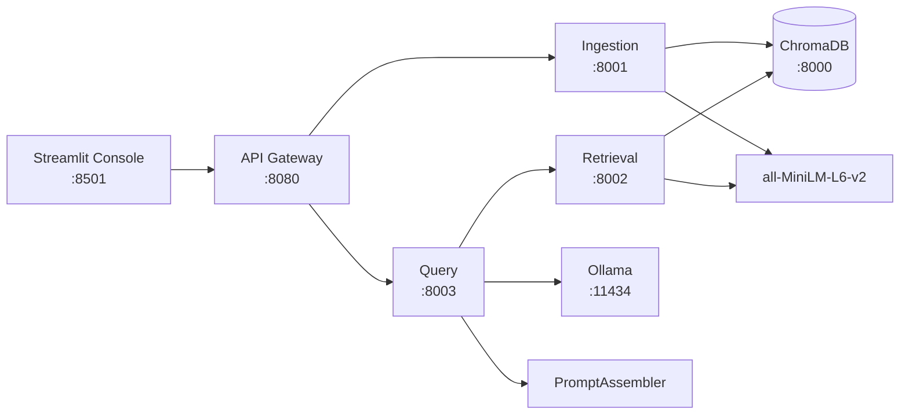

# RAG Operator Console

Full RAG implementation with explicit prompt assembly and operator visibility for debugging and validation. Part of the [GenAI Portfolio Suite](https://github.com/adityonugrohoid).

## Highlights

- **Prompt Assembly** - explicit 4-layer prompt ordering with token-aware budgeting
- **Full Observability** - pipeline metrics, prompt assembly debug, retrieved chunks panel
- **Multi-Model** - 6 local Ollama models across 3 tiers (fast/balanced/quality)
- **Operator Console** - Streamlit UI with Generate, Compare, and RAG Query tabs

## Architecture



## Prompt Assembly

Each query is assembled with strict layer ordering (see [PROMPT_ASSEMBLY.md](docs/PROMPT_ASSEMBLY.md)):

1. **System Instructions** - pinned, never truncated
2. **Retrieved Documents** - highest priority grounding
3. **Clarification Context** - previous turn only, dropped first under token pressure
4. **Current User Question** - always included

The operator console visualizes each layer with token counts and PINNED/DROPPED status.

## Quick Start

```bash
# Start all services
./scripts/start.sh

# Pull models into Ollama
./scripts/pull_models.sh

# Open the operator console
open http://localhost:8501
```

## Services

| Service | Port | Description |
|---------|------|-------------|
| Ollama | 11434 | Local LLM inference (GPU) |
| ChromaDB | 8000 | Vector database |
| Ingestion | 8001 | Document parsing, chunking, embedding |
| Retrieval | 8002 | Vector similarity search |
| Query | 8003 | Prompt assembly + LLM generation |
| API Gateway | 8080 | Unified API for console |
| Console | 8501 | Streamlit operator UI |

## Available Models

| Model | Size | Tier |
|-------|------|------|
| gemma2:2b | 1.6GB | Fast |
| llama3.2:1b | 1.3GB | Fast |
| llama3.2:3b | 2.0GB | Balanced |
| phi3:3.8b | 2.2GB | Balanced |
| mistral:7b | 4.4GB | Quality |
| llama3.1:8b | 4.9GB | Quality |

## RAG Query Tab - Full Observability

The RAG Query tab shows every stage of the pipeline:

- **Response Area** - answer with inline source citations
- **Pipeline Metrics** - timing per stage (Retrieval, Assembly, LLM), tokens, throughput
- **Prompt Assembly Panel** - 4 layers with token counts and PINNED/DROPPED status
- **Retrieved Chunks Panel** - similarity scores, source docs, PII flags, included-in-prompt indicator

## Project Structure

```
rag-operator-console/
  services/
    api_gateway/       API Gateway (:8080)
    ingestion/         Document ingestion (:8001)
    retrieval/         Vector search (:8002)
    query/             Prompt assembly + LLM (:8003)
  shared/
    clients/           Ollama client, embedder, ChromaDB client
    models/            Pydantic schemas
    utils/             Config, logging, PII detector
  console/             Streamlit operator UI
  data/documents/      12 sample docs across 6 categories
  tests/               Prompt assembler, schema, client tests
  scripts/             Start, pull models
  docs/                Architecture, prompt assembly design
```

## Testing

```bash
python3 -m pytest tests/ -v
```

## Sample Documents

12 documents across 6 categories:
- Telecom (network performance, RAN optimization, OSS/BSS)
- Enterprise (employee handbook, IT security)
- Support (product troubleshooting, features)
- Legal (privacy policy, data retention)
- Education (machine learning, Python basics)
- Technical (API reference)

## Author

**Adityo Nugroho** - [GitHub](https://github.com/adityonugrohoid)

## License

MIT
