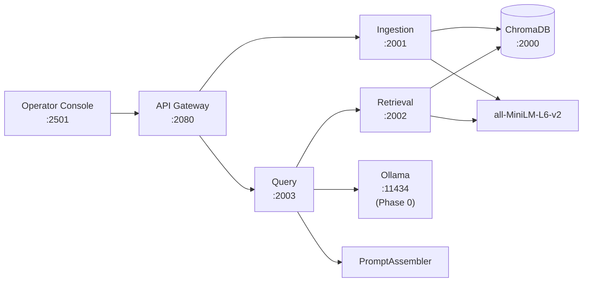

# GenAI Portfolio Suite – Phase 2: RAG Operator Console

Full RAG implementation with explicit prompt assembly and operator visibility for debugging and validation.

**Part of the [GenAI Portfolio Suite](https://github.com/adityonugrohoid).**  
> **Phase:** 2 – RAG Pipeline & Operator Debugging UI

---

## Table of Contents

- [Overview](#overview)
- [Quick Start](#quick-start)
- [Architecture](#architecture)
- [Features](#features)
- [Available Models](#available-models)
- [Requirements](#requirements)
- [API Usage](#api-usage)
- [Project Structure](#project-structure)
- [Tech Stack](#tech-stack)
- [Author](#author)
- [License](#license)

---

## Overview

`rag-operator-console` is a **RAG pipeline plus operator console** designed for:

- Inspecting and debugging RAG behavior
- Visualizing prompt assembly and token budgets
- Understanding which documents and chunks influence answers

It uses a shared Ollama runtime from **Phase 0: [ollama-runtime](https://github.com/adityonugrohoid/ollama-runtime)**.

---

## Quick Start

### Prerequisites

- Docker and Docker Compose
- NVIDIA GPU + drivers (for Ollama GPU acceleration)
- **Phase 0:** [ollama-runtime](https://github.com/adityonugrohoid/ollama-runtime) running

### Start Services

```bash
# 1. Start Ollama (Phase 0)
cd ~/projects/ollama-runtime && ./scripts/start.sh

# 2. Build base images (first time only)
cd ~/projects/rag-operator-console
./scripts/build.sh

# 3. Start all services
./scripts/start.sh

# 4. Pull models into Ollama (if not already done)
./scripts/pull_models.sh

# 5. Open the operator console
# http://localhost:2501
```

### Service URLs

| Service | URL | Description |
|---------|-----|-------------|
| Operator Console | http://localhost:2501 | Streamlit RAG debugging UI |
| API Gateway | http://localhost:2080 | Unified API for console |
| ChromaDB | http://localhost:2000 | Vector database |
| Ingestion | http://localhost:2001 | Document parsing, chunking, embedding |
| Retrieval | http://localhost:2002 | Vector similarity search |
| Query | http://localhost:2003 | Prompt assembly + LLM generation |
| Ollama | http://localhost:11434 | Shared LLM runtime (Phase 0) |

---

## Architecture



Ollama runs as a shared service from **Phase 0: [ollama-runtime](https://github.com/adityonugrohoid/ollama-runtime)**.  
All phases connect via the `ollama-runtime-network` Docker network.

---

## Features

<table>
<tr>
<td align="center">

<br/><strong>2-Turn Clarification Context</strong>
</td>
<td align="center">

<br/><strong>Retrieved Chunks Panel</strong>
</td>
</tr>
</table>

- **Prompt Assembly** – explicit 4-layer prompt ordering with token-aware budgeting (4096 token context)
- **Full Observability** – pipeline metrics, prompt assembly debug, retrieved chunks panel
- **2-Turn Clarification** – previous Q&A automatically carried as context for follow-up questions
- **Multi-Model** – 6 local Ollama models across 3 tiers (fast / balanced / quality)
- **Operator Console** – Streamlit UI focused on RAG query debugging
- **Source Grounding** – inline citations and retrieved chunk visualization

---

## Available Models

> **Default model across Phase 0-1-2:** `llama3.2:3b`

All models are 3B-class Q4_K_M quantized for consistent performance.

| Family    | Model         | Size   | Notes                          |
|-----------|--------------|--------|--------------------------------|
| Meta      | llama3.2:3b  | 2.0 GB | **Default** -- general-purpose |
| Alibaba   | qwen2.5:3b   | 1.9 GB | Strong multilingual support    |
| Microsoft | phi3.5:3.8b  | 2.2 GB | Reasoning, code, structured    |

---

## Requirements

- Docker and Docker Compose
- NVIDIA GPU + drivers (for Ollama GPU acceleration)
- **Phase 0:** [ollama-runtime](https://github.com/adityonugrohoid/ollama-runtime) running

---

## API Usage

```bash
# Ingest a document
curl -X POST http://localhost:2080/documents/upload \
  -F "file=@document.txt"

# List indexed documents
curl http://localhost:2080/documents

# RAG query
curl -X POST http://localhost:2080/query \
  -H "Content-Type: application/json" \
  -d '{"query": "What authentication does the API use?", "model": "llama3.2:3b"}'

# RAG query with clarification context (follow-up question)
curl -X POST http://localhost:2080/query \
  -H "Content-Type: application/json" \
  -d '{
    "query": "What are the rate limits?",
    "model": "llama3.2:3b",
    "clarification_context": "Q: What authentication does the API use?\nA: The API uses Bearer token and API key authentication."
  }'

# Clear all documents
curl -X DELETE http://localhost:2080/documents

# Health check
curl http://localhost:2080/health
```

### Testing

```bash
python3 -m pytest tests/ -v
```

15 tests covering prompt assembly, schemas, and client behavior.

---

## Project Structure

```
rag-operator-console/
├── services/
│   ├── api_gateway/         API Gateway (:2080)
│   ├── ingestion/           Document ingestion (:2001)
│   ├── retrieval/           Vector search (:2002)
│   └── query/               Prompt assembly + LLM (:2003)
│       └── prompt_assembler.py  4-layer assembly with token budgeting
├── shared/
│   ├── clients/             Ollama client, embedder, ChromaDB client
│   ├── models/              Pydantic schemas (QueryRequest, QueryResponse, etc.)
│   └── utils/               Config, logging, PII detector
├── console/
│   └── app.py               Streamlit operator UI (RAG Query + observability)
├── data/
│   └── documents/           12 sample docs across 6 categories
├── tests/                   15 tests (prompt assembler, schemas, clients)
├── scripts/
│   ├── build.sh             Build base + ML base images
│   ├── start.sh             Start services (requires Phase 0)
│   └── pull_models.sh       Download models into Ollama
├── Dockerfile.base          Lightweight base (~500 MB)
├── Dockerfile.ml            ML base with embeddings (~2.5 GB)
├── docker-compose.yaml
├── LICENSE
└── README.md
```

---

## Tech Stack

- **LLM Runtime:** Ollama (via Phase 0)
- **Backend:** FastAPI + Python 3.12
- **Operator UI:** Streamlit
- **Vector DB:** ChromaDB
- **Embeddings:** all-MiniLM-L6-v2 (sentence-transformers)
- **Token Counting:** tiktoken (cl100k_base)
- **Infrastructure:** Docker Compose

---

## Author

**Adityo Nugroho** – [github.com/adityonugrohoid](https://github.com/adityonugrohoid)

---

## License

MIT License – see [LICENSE](LICENSE).
