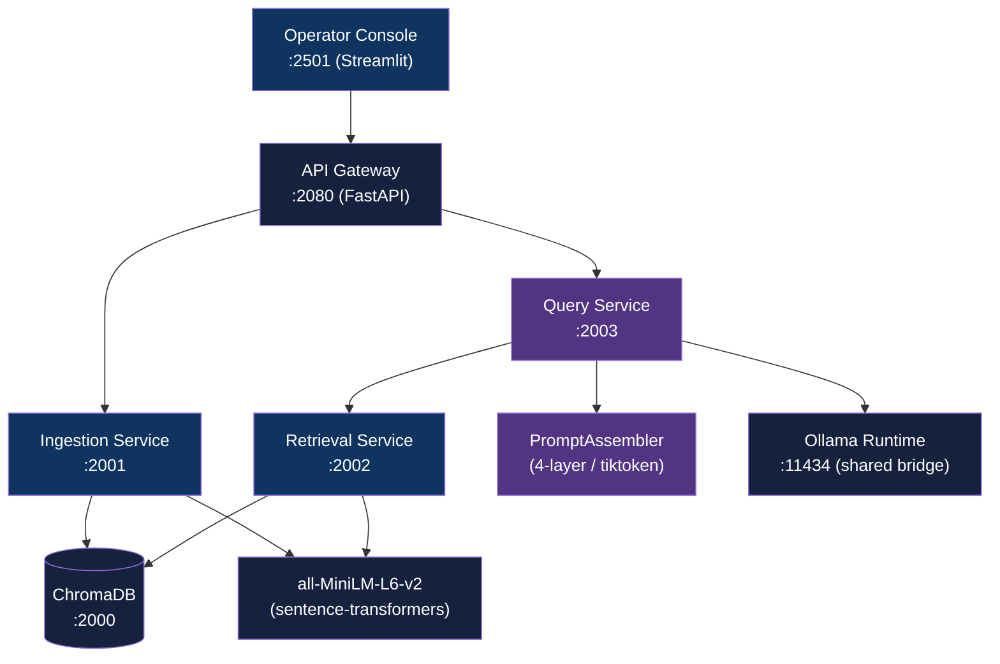

<div align="center">

# RAG Operator Console

[](https://www.python.org/downloads/)
[](https://fastapi.tiangolo.com/)
[](LICENSE)

**RAG pipeline with operator console for prompt assembly, retrieval inspection, and side-by-side response debugging**

[Getting Started](#getting-started) | [Usage](#usage) | [Architecture](#architecture)

</div>

---

## Table of Contents

- [The Problem](#the-problem)
- [Features](#features)
- [Tech Stack](#tech-stack)
- [Architecture](#architecture)
- [Demo](#demo)
- [Getting Started](#getting-started)
  - [Prerequisites](#prerequisites)
  - [Installation](#installation)
- [Usage](#usage)
- [How It Works](#how-it-works)
- [API Reference](#api-reference)
- [Architectural Decisions](#architectural-decisions)
- [Project Structure](#project-structure)
- [Testing](#testing)
- [Deployment](#deployment)
- [Security](#security)
- [Related Projects](#related-projects)
- [License](#license)
- [Author](#author)

## The Problem

### RAG Pipelines Are Black Boxes

Standard RAG implementations hide prompt assembly behind abstractions, making it hard to debug why a model ignored a retrieved chunk, where the token budget was exceeded, or how clarification context was folded in. Operators have no view into intermediate pipeline state.

### The Solution

RAG Operator Console exposes every stage: retrieved chunks with per-chunk token counts, 4-layer prompt assembly with explicit budget allocation, and a side-by-side observability panel so operators can trace exactly why a response was generated.

## Features

- **4-Layer Prompt Assembly** - explicit ordering: system instructions, retrieved documents, clarification context, user question; each layer has a dedicated token budget within a 3000-token context window
- **Retrieved Chunks Panel** - per-chunk token counts, inclusion flags, and source filenames visible in the operator UI
- **Prompt Assembly Debug** - full assembled prompt visible in an expandable panel before and after submission
- **2-Turn Clarification** - previous Q&A carried as a droppable layer so follow-up questions maintain coherence without bloating context
- **Multi-Model Selection** - 3 local Ollama models (llama3.2:3b, qwen2.5:3b, phi3.5:3.8b) switchable at runtime from the console sidebar
- **PII Detection** - rule-based detector screens ingested text for email, phone, SSN, and credit card patterns
- **Microservices Architecture** - ingestion, retrieval, query, and gateway run as independent Docker containers with health checks

## Tech Stack

| Component | Technology |
|-----------|------------|
| Language | Python 3.12+ |
| Backend Services | FastAPI |
| Operator UI | Streamlit |
| Vector Database | ChromaDB |
| Embeddings | all-MiniLM-L6-v2 (sentence-transformers) |
| Token Counting | tiktoken (cl100k_base) |
| LLM Runtime | Ollama (llama3.2:3b, qwen2.5:3b, phi3.5:3.8b) |
| Infrastructure | Docker Compose |

## Architecture



Ollama runs as a shared service connected via the `ollama-runtime-network` Docker bridge, accessible to all services without duplication.

## Demo

| Panel | Screenshot |
|-------|------------|
| Prompt Assembly Debug |  |
| Retrieved Chunks |  |
| Source Citations + Metrics |  |
| Document Management |  |
| 2-Turn Clarification Context |  |

## Getting Started

### Prerequisites

- Docker and Docker Compose
- NVIDIA GPU with drivers (for Ollama GPU acceleration)
- [ollama-runtime](https://github.com/adityonugrohoid/ollama-runtime) running and connected via `ollama-runtime-network`

### Installation

1. Clone the repository:
   ```bash
   git clone https://github.com/adityonugrohoid/rag-operator-console.git
   cd rag-operator-console
   ```

2. Build base images (first time only):
   ```bash
   ./scripts/build.sh
   ```

3. Start all services:
   ```bash
   ./scripts/start.sh
   ```

4. Pull models into Ollama (if not already pulled):
   ```bash
   ./scripts/pull_models.sh
   ```

## Usage

Open the operator console at `http://localhost:2501`.

**To ingest documents:**

1. Use the sidebar file uploader (txt, pdf, docx supported)
2. Click "Ingest" and wait for the indexing confirmation

**To run a RAG query:**

1. Select a model from the sidebar (default: `llama3.2:3b`)
2. Type a question in the main panel and submit
3. Expand "Prompt Assembly Debug" to inspect the assembled prompt and token breakdown
4. Expand "Retrieved Chunks" to see which document sections were included or dropped

**Service URLs:**

| Service | URL |
|---------|-----|
| Operator Console | http://localhost:2501 |
| API Gateway | http://localhost:2080 |
| ChromaDB | http://localhost:2000 |
| Ingestion | http://localhost:2001 |
| Retrieval | http://localhost:2002 |
| Query | http://localhost:2003 |
| Ollama | http://localhost:11434 |

## How It Works

### 1. Document Ingestion

Uploaded documents are chunked and embedded by the ingestion service using `all-MiniLM-L6-v2`. Chunks and their embeddings are stored in ChromaDB with source filename metadata. The PII detector screens text before storage.

### 2. Retrieval

The retrieval service accepts a query string, embeds it with the same model, and performs cosine similarity search against ChromaDB. It returns ranked chunks with token counts and metadata.

### 3. Prompt Assembly

`PromptAssembler` stacks the retrieved chunks into a 4-layer prompt within a 3000-token budget using tiktoken (cl100k_base):

| Layer | Priority | Dropped when over budget |
|-------|----------|--------------------------|
| 1: System instructions | Pinned (never dropped) | No |
| 2: Retrieved documents | Highest grounding value | Last |
| 3: Clarification context | Previous turn only | First |
| 4: Current question | Always included | No |

The assembly result includes per-layer token counts, chunk inclusion flags, and the full message list passed to Ollama.

### 4. Operator Observability

The Streamlit console renders the prompt assembly metadata as expandable panels alongside the response, so operators can correlate answer quality with chunk selection and budget allocation.

## API Reference

All endpoints are served by the API Gateway at `:2080`.

| Method | Endpoint | Description |
|--------|----------|-------------|
| `POST` | `/documents/upload` | Upload and ingest a document |
| `GET` | `/documents` | List indexed documents with count |
| `DELETE` | `/documents` | Clear all indexed documents |
| `POST` | `/query` | RAG query with optional clarification context |
| `GET` | `/health` | Health check |

### Example: RAG Query

```bash
curl -X POST http://localhost:2080/query \
  -H "Content-Type: application/json" \
  -d '{"query": "What authentication does the API use?", "model": "llama3.2:3b"}'
```

### Example: Query with Clarification Context

```bash
curl -X POST http://localhost:2080/query \
  -H "Content-Type: application/json" \
  -d '{
    "query": "What are the rate limits?",
    "model": "llama3.2:3b",
    "clarification_context": "Q: What authentication does the API use?\nA: The API uses Bearer token and API key authentication."
  }'
```

## Architectural Decisions

### 1. Explicit 4-Layer Prompt Assembly Over Framework Abstractions

**Decision:** Prompt construction is handled by a custom `PromptAssembler` class with explicit layer definitions and token budgeting via tiktoken rather than using LangChain or LlamaIndex prompt templates.

**Reasoning:** Framework abstractions hide token allocation decisions. Explicit layers make budget enforcement auditable and let the operator UI show exactly which chunks were included or dropped and why.

### 2. Dual Dockerfile Strategy (base + ml-base)

**Decision:** Two base images: `Dockerfile.base` (~500 MB, shared utilities) and `Dockerfile.ml` (~2.5 GB, sentence-transformers). Only ingestion and retrieval services inherit the ML base.

**Reasoning:** Services that do not embed (gateway, query, console) avoid the 2.5 GB ML dependency. Build time and image layer caching improve significantly for the majority of services.

### 3. Shared Ollama Runtime via Docker Bridge Network

**Decision:** Ollama runs as a separate container in a sibling repo (`ollama-runtime`) connected via `ollama-runtime-network`. This service does not bundle its own Ollama instance.

**Reasoning:** Ollama with GPU pass-through and loaded models consumes 4-8 GB of GPU memory. Sharing one runtime across multiple projects avoids duplication and prevents VRAM contention.

## Project Structure

```
rag-operator-console/
├── services/
│   ├── api_gateway/         API Gateway (:2080)
│   ├── ingestion/           Document parsing, chunking, embedding (:2001)
│   ├── retrieval/           Vector similarity search (:2002)
│   └── query/               Prompt assembly + LLM generation (:2003)
│       └── prompt_assembler.py  4-layer assembly with token budgeting
├── shared/
│   ├── clients/             Ollama client, embedder, ChromaDB client
│   ├── models/              Pydantic schemas (QueryRequest, QueryResponse, etc.)
│   └── utils/               Config, logging, PII detector
├── console/
│   └── app.py               Streamlit operator UI
├── data/
│   └── documents/           12 sample docs across 6 categories
├── tests/                   Prompt assembler, schema, and client tests
├── scripts/
│   ├── build.sh             Build base + ML base images
│   ├── start.sh             Start services
│   └── pull_models.sh       Pull models into Ollama
├── Dockerfile.base          Shared utilities base (~500 MB)
├── Dockerfile.ml            ML base with embeddings (~2.5 GB)
├── docker-compose.yaml
├── pytest.ini
├── LICENSE
└── README.md
```

## Testing

```bash
# Run all tests
python -m pytest tests/ -v

# Run specific module
python -m pytest tests/test_prompt_assembler.py -v
```

| Module | Coverage |
|--------|----------|
| `test_prompt_assembler.py` | PromptAssembler layer ordering, token budgeting |
| `test_ollama_client.py` | Client defaults, model availability |
| `test_schemas.py` | QueryRequest, QueryResponse validation |

## Deployment

### Docker Compose (local)

```bash
# Build base images
./scripts/build.sh

# Start all services
./scripts/start.sh

# Verify health
curl http://localhost:2080/health
```

### Stopping Services

```bash
docker compose down
```

Data persists in the `chroma_data` Docker volume between restarts.

## Security

- **PII Detection** - ingested documents are screened for email addresses, phone numbers, SSNs, and credit card numbers via rule-based patterns in `shared/utils/pii_detector.py`
- **CORS** - API Gateway allows all origins by default; restrict `allow_origins` in `services/api_gateway/main.py` before exposing to a network

To report a vulnerability, please open an issue or contact the maintainer directly.

## Related Projects

| Project | Description |
|---------|-------------|
| [ollama-runtime](https://github.com/adityonugrohoid/ollama-runtime) | GPU-accelerated Ollama runtime container with shared Docker bridge network for multi-app local LLM serving |
| [ollama-multi-llm-server](https://github.com/adityonugrohoid/ollama-multi-llm-server) | Multi-model inference API and Streamlit playground over local Ollama LLMs |

## License

This project is licensed under the [MIT License](LICENSE).

## Author

**Adityo Nugroho** ([@adityonugrohoid](https://github.com/adityonugrohoid))
