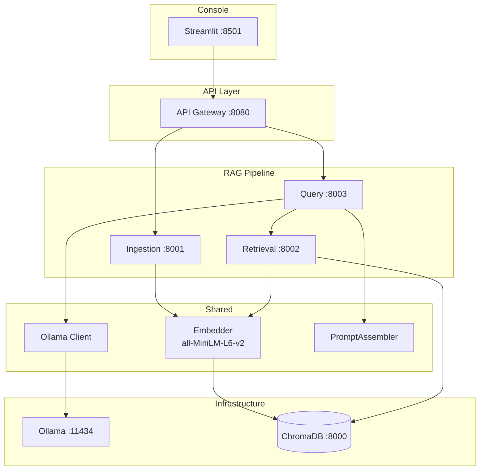

# Architecture

## Overview

RAG Operator Console is a 4-microservice RAG platform with an explicit PromptAssembler module and a Streamlit operator console for full pipeline observability.

## Service Architecture

## Data Flow

### Ingestion

1. Document uploaded via API Gateway
2. Ingestion service parses (txt/pdf/docx), chunks text
3. Embedder generates 384-dim vectors (all-MiniLM-L6-v2)
4. PII detector flags sensitive content
5. Chunks + embeddings + metadata stored in ChromaDB

### Query (RAG Pipeline)

1. User submits question via console (with model/temperature/max_tokens)
2. API Gateway forwards to Query service
3. Query service calls Retrieval service for top-5 chunks
4. Retrieval service embeds query and searches ChromaDB
5. PromptAssembler builds 4-layer prompt with token budget:
   - Layer 1: System instructions (pinned)
   - Layer 2: Retrieved documents (highest priority)
   - Layer 3: Clarification context (dropped first)
   - Layer 4: User question (pinned)
6. Ollama client sends assembled prompt to LLM
7. Full response returned with pipeline metrics, assembly metadata, chunk details

## Key Components

### PromptAssembler

Located at `services/query/prompt_assembler.py`. Implements the 4-layer prompt ordering with token-aware budgeting via tiktoken (cl100k_base encoding).

### Ollama Client

Located at `shared/clients/ollama_client.py`. Focused client for local Ollama models only (Phases 1-4). Supports 6 models across 3 tiers.

### Observability Response

The QueryResponse includes:
- `pipeline_metrics` - timing per stage, tokens, throughput
- `prompt_assembly` - per-layer token counts, budget utilization
- `retrieved_chunks` - similarity scores, PII flags, included-in-prompt indicator

All returned in a single API response (no extra calls needed).
